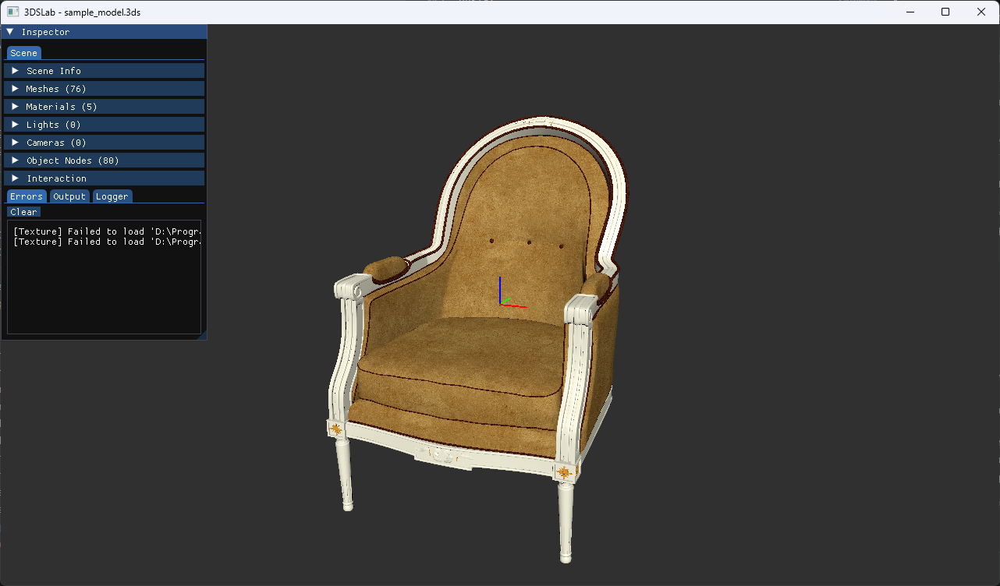

# 3DSLab

A 3DS file importer and viewer built with **bgfx**, **GLFW**, and **Dear ImGui**.

Parses binary `.3ds` files (3D Studio Max format) and displays geometry, materials, lights, cameras, and animation node hierarchies in an interactive inspector.



## Dependencies

All fetched automatically by CMake via FetchContent — no manual installation needed.

| Library | Version |
|---------|---------|
| [bgfx](https://github.com/bkaradzic/bgfx) | master (via bgfx.cmake) |
| [GLFW](https://www.glfw.org/) | 3.4 |
| [Dear ImGui](https://github.com/ocornut/imgui) | v1.91.8 |
| [Eigen](https://eigen.tuxfamily.org/) | 3.4.0 |

## Prerequisites

- **CMake** 3.20+
- **Ninja**
- **LLVM/Clang** (`clang-cl`)
- **Visual Studio 2022 Build Tools** (MSVC + Windows SDK)

## Building

Every build session requires the MSVC environment to be active. Use the VS Developer Shell or run:

```powershell
& "$(vswhere -latest -products * -requires Microsoft.VisualStudio.Component.VC.Tools.x86.x64 -property installationPath)\Common7\Tools\Launch-VsDevShell.ps1" -Arch amd64 -HostArch amd64
```

Configure (first time, or after changing `CMakeLists.txt`):

```powershell
cmake -B build -G Ninja -DCMAKE_BUILD_TYPE=Debug `
  "-DCMAKE_C_COMPILER=C:/Program Files/LLVM/bin/clang-cl.exe" `
  "-DCMAKE_CXX_COMPILER=C:/Program Files/LLVM/bin/clang-cl.exe"
```

Build:

```powershell
cmake --build build --config Debug
```

## Running

From the project root:

```powershell
.\build\3DSLab.exe
```

Drag and drop a `.3ds` file onto the viewport to load it.

## Features

### Inspector Panel

- **Scene** tab — scene metadata (version, scale, ambient light, frame count) with collapsible sections for:
  - **Meshes** — vertex/face counts, bounding box, mesh matrix, materials
  - **Materials** — color swatches (ambient/diffuse/specular), shininess, transparency, texture maps
  - **Lights** — name, position, type (omni/spot), intensity
  - **Cameras** — position, target, FOV
  - **Object Node Hierarchy** — full animation node tree with parent-child relationships
- **Interaction** — toggle pivot marker

### Output Panel

- **Errors** — captured `stderr` with clear button
- **Output** — captured `stdout` (selection events, node info)
- **Logger** — verbose parse/debug trace from the parser and scene loader

## Controls

| Input | Action |
|-------|--------|
| Left drag | Rotate view |
| Right drag | Pan camera |
| Scroll wheel | Zoom |
| Click mesh | Select |
| `N` / `P` | Next / previous mesh |
| `C` | Clear selection |
